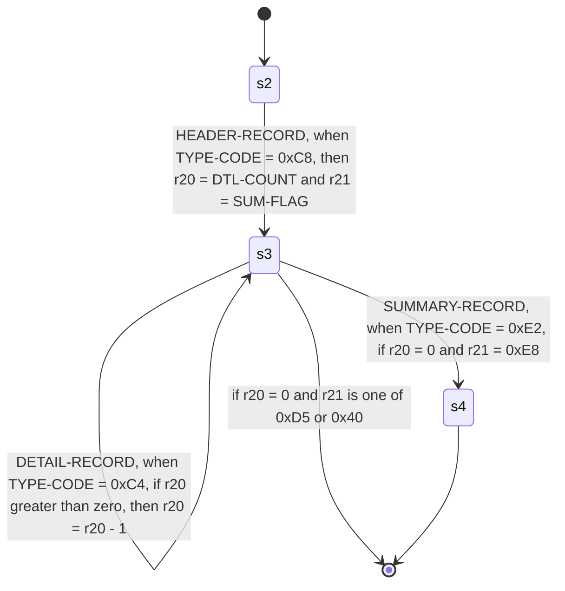

# `cpybkc-gen-graph`

The diagram generator: it reads a resolved cpybkc IR descriptor and writes a
state-machine diagram of the sequencing automaton, with each record's items
tabled beneath it.

It answers the question an adopter asks before they trust a layout — *the right
records, in the right order, told apart on the right bytes, at the right
offsets* — which nothing else this project ships answers. `cpybkc --emit-ir`
renders the IR as JSON, and that is deliberately [a node set, not a
tree](../../docs/ir/SPEC.md#a-node-set-not-a-tree): nobody can read a record
order out of it. What [`cpybkc-gen-go`](../cpybkc-gen-go/) writes is correct Go
and, for this purpose, unreadable — the automaton arrives as a `switch` over
integer state indices.

It is also the second consumer of [the plugin CLI
contract](../../docs/plugin/SPEC.md), and the first that did not ship with it.
Like `cpybkc-gen-go` it imports `github.com/Zaba505/cpybkc/irpb` and the
standard library and nothing else from this repository, so the surface it
exercises is the one a third-party generator author has.

> **`format=dot` is still an empty digraph.** Everything below describes the
> Mermaid document, which is what `format=mermaid` — the default — writes. The
> Graphviz rendering is a story of its own.

## Invocation

```
cpybkc-gen-graph --descriptor <path> --out <dir> [--opt k=v ...]
```

`--descriptor` and `--out` are required and each appears exactly once.
`--descriptor -` reads the descriptor from standard input; cpybkc never emits
that form, and it is accepted so that this generator is drivable from a pipeline
with nowhere convenient to put the bytes. `--` ends the options, and there are
no operands after it — this generator takes none.

Only the separated form is accepted, each flag followed by its value as the next
argument. That is the form cpybkc emits and the one the contract requires a
plugin to accept; `--descriptor=<path>` is not accepted.

You do not normally type any of this. cpybkc builds the vector from
[`cpybkc.json`](../../README.md#the-project-manifest), passing each entry of a
generator's `options` object as one `--opt k=v` in the order the object writes
them:

```json
{
  "name": "graph",
  "out": "docs",
  "options": {"format": "mermaid", "records": "all"}
}
```

## Options

| Key | Required | Values | Default | What it is |
|---|---|---|---|---|
| `format` | no | `mermaid`, `dot` | `mermaid` | The notation the document is written in. |
| `records` | no | `all`, `none` | `all` | Whether each record's items are tabled beneath the diagram. |

An option this generator does not recognise is an **error**, not something
ignored — as is either key given twice, or a value outside its set. An ignored
option is a line in a checked-in manifest that reads as configuration and does
nothing, and the user finds out by noticing that the output never changed. A
value outside a set is refused rather than rounded to the default for the same
reason: `format=graphviz` names the notation you meant, and silently drawing
Mermaid for it is a document that is wrong in a way nothing says.

`format` defaults to `mermaid` because that document renders in place: an adopter
checking a layout in is looking at the diagram in a pull request, and a `dot`
there is a file they would have to run something over first. `dot` is for a
build that turns diagrams into images, and for a layout large enough that
Graphviz's layout engine is worth having.

`records` exists because the two questions this diagram answers are asked at
different sizes. *Are these the right records, in the right order, told apart on
the right bytes* is the automaton alone, and it stays legible for a layout with
dozens of records; *and are they the right fields at the right offsets* needs
every item, which on a real copybook is a page per record. One document cannot
be both. It defaults to `all` because a layout small enough to check by eye is
the case this generator is for, and a reader who wants the automaton on its own
knows to ask — where the other default would hide the offsets from somebody who
did not know to.

There is no option for the output file's name; see below.

## Output

One file, written beneath `--out`, named for the format:

| `format` | File |
|---|---|
| `mermaid` | `graph.md` — a Markdown document holding a `mermaid` block |
| `dot` | `graph.dot` — a Graphviz `digraph` |

The names are fixed and there is no option to change them. The descriptor
carries no name for the layout it describes, and [the
contract](../../docs/plugin/SPEC.md#the-descriptor) forbids deriving anything
from the descriptor's path or the directory holding it — while `--out` is a
scratch directory whose name cpybkc chooses and varies between runs. A filename
taken from any of those would make the output a function of a path, which is
what *Determinism* forbids.

cpybkc creates `--out` empty for this invocation and merges it into the
project's tree only once every generator in the run has succeeded. Two runs
given the same descriptor and the same options produce byte-identical files:
nothing in the output comes from the clock, the environment, the host, the user
or the paths in the argument vector.

### What the Markdown document holds

A heading, the file's framing as a sentence, a `mermaid` block holding the
sequencing automaton as a `stateDiagram-v2`, — where the layout has any — a
table of the registers the automaton carries between records, and — unless
`records=none` said otherwise — one table per record of its items and their
offsets:



- **A state is `s` and its own IR node identifier.** States carry identifiers
  and no names, and the identifier is what takes you to the same node in
  `cpybkc --emit-ir` when the diagram is not enough.
- **`[*] --> s2` is the start state**, which is the file node's
  `start_state_id`, and **`s4 --> [*]` is an accepting state** — one where
  reaching the end of the input is a complete file rather than a truncated one.
- **An edge label opens with the record its transition admits**, by the rename
  your layout gave it where it gave one and by the copybook's own spelling
  otherwise.
- **Edges leave a state in the order the state carries them**, because that is
  the order a consumer evaluates them in and the first one that matches wins.
- **Every state the descriptor carries is drawn**, including one nothing
  reaches. Those are marked *unreachable* and called out above the diagram: a
  state no path arrives at is a bug in whatever compiled the automaton, and
  leaving it out would make this document agree with a descriptor that is wrong.

#### Why an edge is taken

Behind the record name an edge label reads as a sentence, in three sections.
`if` and `then` are left out where the transition carries no guard and no
binding; `when` is always there, because a transition carrying no predicate says
so rather than saying nothing:

| Section | What it is |
|---|---|
| `when …` | The **predicate**: the field whose bytes select this transition, named by its path within the record, and the test made of it — `= <literal>` or `is one of <literal> or <literal>`. |
| `if …` | The **guards**: what makes the transition eligible at all, before the record in front of the reader is examined. All of them must hold, so they are joined with `and`. |
| `then …` | The **bindings**: what the transition writes into the register file once it is taken. |

`no predicate` stands where `when …` would, because [a transition may carry
none](../../docs/ir/SPEC.md#a-transition-may-carry-no-predicate) and that is a
meaning rather than a gap: such a transition matches every record, is selected
by its guards alone, and gives up the undescribed-record diagnostic at the state
that offers it. It is not the same as a predicate whose literal happens to be
trivial — that draws as `when TYPE-CODE = ""` — and the document does not draw
the two alike.

**An accepting state's guards are on its `--> [*]` edge.** Acceptance may be
conditional — `s3 --> [*]: if r20 = 0` is a state where end of input is a
complete file *only* with the counter run down — and that is what makes a file
two records short detectable. An accepting state drawn without them would say
the opposite.

**A literal is bytes unless the field it is tested against is ASCII.** `0x40` is
`@` in ASCII and a space in cp037, so a document that read a printable byte as
text because it happened to be printable would print `"@"` for a literal that is
a space in your file. Where the target field's charset *is* ASCII the literal is
quoted text, and the quotes are there so that the padding the producer applied
is visible: whether a literal is `"Y"` or `"Y "` is exactly the kind of thing you
are reading this document to check. A guard's literal is always bytes, because a
guard reads a register and a register declares its kind and no charset.

#### The register table

Registers are how the automaton [remembers between
records](../../docs/ir/SPEC.md#the-automaton-remembers-in-registers) — a header's
count governing the run of details behind it, a header's flag governing whether
a summary appears. A binding writes one, a guard reads one, and nothing else
does either.

A register carries an identifier and no name, so an `r20` in an edge label means
nothing on its own. The table is what turns it into something you can follow:

| Register | Holds | Bound by |
| --- | --- | --- |
| r20 | an integer | `s2 --> s3` (HEADER-RECORD), `s3 --> s3` (DETAIL-RECORD) |
| r21 | bytes | `s2 --> s3` (HEADER-RECORD) |

Every register node is listed, including one no transition binds — that is
either a node nothing needed or a guard reading a value nothing put there, and
the second is a [malformed
descriptor](../../docs/ir/SPEC.md#the-automaton-remembers-in-registers) rather
than an empty cell. The section is left out entirely for a layout whose
sequencing needs no memory, which carries no register node at all.

#### The item tables

Beneath the diagram, one table per record the automaton admits, listing its
items in containment order:

| Offset | Width | Item | Usage | Picture | Present |
| --- | --- | --- | --- | --- | --- |
| 0 | 1 | REC-TYPE | DISPLAY | X(1) | always |
| 1 | 2 | ENTRY-COUNT | DISPLAY | 9(2) | always |
| 3 | 1 | *slack* | — | — | always |
| 4 | 4 × ENTRY-COUNT | ENTRIES | — | — | occurs ENTRY-COUNT times (1 to 20) |
| 4 | 1 | ENTRIES.ENTRY-KIND | DISPLAY | X(1) | always |
| 5 | 3 | ENTRIES.*variant* | — | — | always |
| 5 | 3 | ENTRIES.CASH | — | — | when ENTRIES.ENTRY-KIND = 0xC1 |
| 5 | 3 | ENTRIES.CASH.CASH-AMOUNT | PACKED-DECIMAL | S9(3)V9(2) | always |
| 5 | 3 | ENTRIES.CHEQUE-NUMBER | DISPLAY | 9(5) | when ENTRIES.ENTRY-KIND = 0xC3 |
| 4 + 4 × ENTRY-COUNT | 12 | TRAILERS | — | — | occurs 3 times |
| 4 + 4 × ENTRY-COUNT | 2 | TRAILERS.TRAILER-TAG | DISPLAY | X(2) | always |
| 6 + 4 × ENTRY-COUNT | 2 | TRAILERS.TRAILER-SEQ | DISPLAY | 9(2) | always |
| 16 + 4 × ENTRY-COUNT | 4 | INDEX-SLOT | INDEX | — | always |
| 20 + 4 × ENTRY-COUNT | 2 | *filler* | DISPLAY | X(2) | always |
| 22 + 4 × ENTRY-COUNT | 1 | *filler* | — | — | always |
| 22 + 4 × ENTRY-COUNT | 1 | *filler*.NOTE-CODE | DISPLAY | X(1) | always |
| 23 + 4 × ENTRY-COUNT | ENTRY-COUNT | FLAGS | DISPLAY | X(1) | occurs ENTRY-COUNT times (1 to 20) |

That is one record of
[`testdata/variable.md`](testdata/variable.md) verbatim, rows and all — an
example with some of the rows taken out would teach a rule this generator does
not have, and the rule a reader would infer from a table missing `TRAILERS`'
members is exactly the wrong one.

**One table per record, not per transition.** A record admitted from three
states is the same bytes each time, so three tables would be three copies of one
fact and you would be comparing them for a difference that cannot exist. They
appear in the order the diagram first admits each, which is the order a file
holds them in.

**An item is named by its path within the record**, without the record's own
top level — the same convention a predicate takes in an edge label, and for the
same reason: the heading above the table already says which record it is.

**Two things in these tables are derived rather than read**, and both are said in
the document itself as well as here, because a reader comparing a column against
a copybook has to know which side is authoritative before a disagreement means
anything.

The first is the **offset**. No IR node carries one: [position is stated once,
as ordering and width](../../docs/ir/SPEC.md#ordering-and-width-and-no-offset),
so that a producer cannot state it a second time and be wrong in a way no
consumer can detect. The cost that section names is that "every consumer is free
to get it wrong on its own", and this generator is now one of them — every
offset above is its own arithmetic over the widths ahead of the item, counting
one occurrence, the first, of every group that encloses it and repeats.

The second is the **picture**. The IR carries no PICTURE character-string
anywhere; it carries a category, a count of `9` symbols, the scale, whether the
item is signed and where its sign sits, and the column is this generator's
spelling of those five facts. `S9(5)V99`, `S9(5)V9(2)` and `S99999V99` are one
item and this prints one of them, so a picture that does not match your copybook
character for character is not necessarily a disagreement.

An **edited** item is named and nothing of it is spelled — `numeric-edited`,
`alphanumeric-edited`. Its editing characters are carried nowhere at all, and
neither is anything this generator could put in their place: the digit count is
a count of `9` symbols, and an edited picture's `Z` and `*` are digit positions
too, so `ZZ,ZZ9.99` carries three of them and holds seven digits. Printing three
would state something about storage that is wrong, in the one category where
nothing else in the row lets you check it.

The **length of an alphabetic or alphanumeric picture is the item's width in
bytes**, which is the one cell not derived from the picture at all — the digit
count counts `9` symbols and those pictures have none. It is the character count
because every charset the IR admits is one byte per character; the one
multi-byte thing in the schema is `NATIONAL`, which carries no picture.

The **sign position is spelled whenever it is asked**, the default included:
`SIGN TRAILING` is a position and not an absence, and it is the one axis where
the answer changes which byte the sign is in. A signed numeric `DISPLAY` item
that states no position is refused rather than drawn as a bare `S9(3)`, and so
is the mirror of it — an unsigned item, or one of a `USAGE` the `SIGN` clause
cannot reach, that states a position anyway.

**A data-dependent offset is symbolic, never a number.** Where something ahead
of an item is a table whose number of occurrences is [read at run
time](../../docs/ir/SPEC.md#a-variable-record-is-a-sum-with-a-variable-term),
there is no number to print: the offset carries its fixed part and one term per
such table, naming the count — a field by its path within the record, or a
register by the name the register table gives it.

**Slack appears as a row.** [Any byte of a record no item
occupies](../../docs/ir/SPEC.md#slack-is-a-node-not-a-rule) is a node of its own
carrying its width, and a table that left them out would show a gap between two
offsets that you would take for an error in this generator. They have no names,
so the cell reads `*slack*` in this generator's own words rather than the
copybook's.

**A `FILLER` reads `*filler*`**, for the same reason and by the same rule: COBOL
gives it no data-name, so the IR carries no name for it, and this generator
supplies a word rather than leaving a blank. A `FILLER` *group* is walked into
like any other and its members read beneath it — `*filler*.NOTE-CODE` is an item
inside an unnamed group, and not an item of the record. Anything in italics in
the `Item` column is this generator's word; a name from your copybook is upright,
and one that contains an asterisk of its own is escaped so that it cannot
impersonate one.

**A variant's arms share one offset**, which is what the repeated number down
the Offset column is saying: they are [alternatives over one run of
bytes](../../docs/ir/SPEC.md#a-variant-is-chosen-once-per-occurrence) and not
items that follow one another. An arm has no name of its own, so what tells them
apart is the predicate that selects it, in the last column.

**The last column says what makes an item present and how many times**: `always`
for an item that is there once and unconditionally, `occurs 12 times` for a
constant table, `occurs COUNT-FIELD times (1 to 20)` for an `OCCURS DEPENDING
ON` one with the bounds the copybook declared, and `when …` for an arm.

Where an item's USAGE or category is something the descriptor does not say —
a `USAGE` outside the closed set, a `DISPLAY` item carrying no picture, an
`INDEX` item carrying one, either half of the sign contradiction above — the
document is refused rather than drawn with a blank or a guess, on the same terms
as any other malformed descriptor below. An item COBOL simply did not name is
not one of those; that is a `FILLER`, and it is drawn.

`records=none` leaves this whole section out. Nothing above the diagram changes,
and a record's items are not read at all under it — so a descriptor whose
sequencing is sound and whose item bodies are not still produces the diagram.

#### When a reference does not resolve

Every reference this document draws is resolved by identifier and by the kind
its position admits — a predicate, a guard, a binding, a register, and the field
a predicate tests or a binding reads. One that does not resolve, or that resolves
to a node of the wrong kind, is an `error:` naming the identifier, and no
document is written. A field a predicate names and the record does not carry is
the same: a diagram is a thing somebody is about to trust, and a blank where a
test should be reads as a transition that tests nothing.

The framing is stated because it is the question a state machine cannot answer.
What stands between two records — nothing, a descriptor word, segments, or a
delimiter with a placement — is part of what you are checking, and the
delimiter is printed as bytes (`0x0D 0x0A`) rather than named as a character,
because [nothing names the byte that ends a
record](../../docs/ir/SPEC.md#a-delimiter-is-bytes-not-a-character).

A record name is escaped before it becomes a label. A letter, digit, space,
`-`, `_` or `.` is written as it stands — COBOL names are full of hyphens and
`ORDER#45;HEADER` is a diagram nobody reads — and every other character becomes
Mermaid's `#<code point>;`. A renderer that decodes those shows the name; one
that does not shows the escape. Neither can produce a block that fails to parse,
which is the property being bought.

An automaton admitting no record produces a document saying so, with the start
state still drawn. It is a layout describing a file of no records, which is a
thing to look at rather than nothing to draw — and there are no item tables
beneath it either, since nothing is admitted to table. A record whose top level
holds no item does get a heading, with a sentence in place of the table saying
that it describes no bytes at all.

## The IR version check

cpybkc runs a generator without a handshake of any kind: it does not ask what
this program supports, and it does not compare the descriptor's version against
anything. So this generator reads the descriptor's IR version **before anything
else in the message** — off the wire, before the message is decoded — and
refuses a version it does not implement, writing no file and exiting non-zero.

```
error: descriptor IR version 2; cpybkc-gen-graph 0.0.0-dev implements IR version 1
note: upgrade cpybkc-gen-graph if the descriptor is newer than it, or generate with a cpybkc that writes IR version 1 if it is not
```

The refusal names three facts — the descriptor's version, the highest this
generator implements, and this generator's own version — because nothing else is
in a position to compose that diagnostic, and a refusal naming one number leaves
you unable to tell an out-of-date generator from an out-of-date CLI.

A descriptor one version too new decodes cleanly, since protobuf hands an
unknown field to an old reader and tells it to ignore one. That is why the check
is not optional: without it this generator would draw a confident picture of an
automaton it had understood only in part, which is worse than no picture.

## Diagnostics and exit status

Everything this program has to say goes to standard error as
`<severity>: <message>`, one line each, with `error`, `warning` and `note` the
only severities. A non-zero exit means the invocation failed and cpybkc discards
the output directory; no particular non-zero value means anything beyond that.

## Why the name is `graph`

The notation is an option, so the executable may not be called `cpybkc-gen-dot`
or `cpybkc-gen-mermaid`: a manifest naming two generators to draw one automaton
twice would be naming the same read of the same descriptor twice, and the
`cpybkc-gen-<name>` namespace would carry two entries for one generator.
