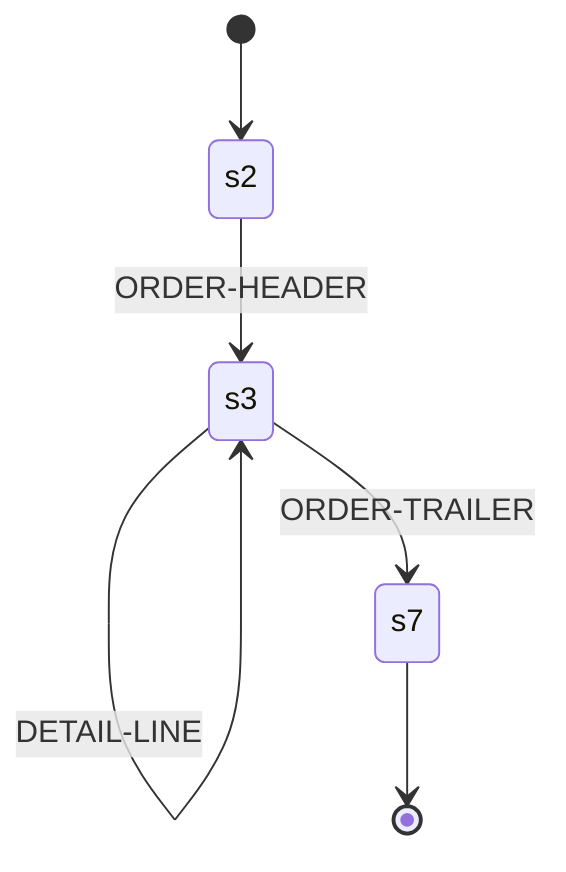

# `cpybkc-gen-graph`

The diagram generator: it reads a resolved cpybkc IR descriptor and writes a
state-machine diagram of the sequencing automaton, with each record's items
beneath the state that reads it.

It answers the question an adopter asks before they trust a layout — *the right
records, in the right order, told apart on the right bytes, at the right
offsets* — which nothing else this project ships answers. `cpybkc --emit-ir`
renders the IR as JSON, and that is deliberately [a node set, not a
tree](../../docs/ir/SPEC.md#a-node-set-not-a-tree): nobody can read a record
order out of it. What [`cpybkc-gen-go`](../cpybkc-gen-go/) writes is correct Go
and, for this purpose, unreadable — the automaton arrives as a `switch` over
integer state indices.

It is also the second consumer of [the plugin CLI
contract](../../docs/plugin/SPEC.md), and the first that did not ship with it.
Like `cpybkc-gen-go` it imports `github.com/Zaba505/cpybkc/irpb` and the
standard library and nothing else from this repository, so the surface it
exercises is the one a third-party generator author has.

> **It draws the automaton, and not yet what hangs off it.** The states, the
> transitions between them and the record each admits are in the Mermaid
> document today. The predicates, guards, bindings and registers that *choose* a
> transition are not, and neither are each record's items with their offsets;
> both are stories of their own. `format=dot` is still an empty digraph.

## Invocation

```
cpybkc-gen-graph --descriptor <path> --out <dir> [--opt k=v ...]
```

`--descriptor` and `--out` are required and each appears exactly once.
`--descriptor -` reads the descriptor from standard input; cpybkc never emits
that form, and it is accepted so that this generator is drivable from a pipeline
with nowhere convenient to put the bytes. `--` ends the options, and there are
no operands after it — this generator takes none.

Only the separated form is accepted, each flag followed by its value as the next
argument. That is the form cpybkc emits and the one the contract requires a
plugin to accept; `--descriptor=<path>` is not accepted.

You do not normally type any of this. cpybkc builds the vector from
[`cpybkc.json`](../../README.md#the-project-manifest), passing each entry of a
generator's `options` object as one `--opt k=v` in the order the object writes
them:

```json
{
  "name": "graph",
  "out": "docs",
  "options": {"format": "mermaid", "records": "all"}
}
```

## Options

| Key | Required | Values | Default | What it is |
|---|---|---|---|---|
| `format` | no | `mermaid`, `dot` | `mermaid` | The notation the document is written in. |
| `records` | no | `all`, `none` | `all` | Whether each record's items are drawn beneath the state that reads it. |

An option this generator does not recognise is an **error**, not something
ignored — as is either key given twice, or a value outside its set. An ignored
option is a line in a checked-in manifest that reads as configuration and does
nothing, and the user finds out by noticing that the output never changed. A
value outside a set is refused rather than rounded to the default for the same
reason: `format=graphviz` names the notation you meant, and silently drawing
Mermaid for it is a document that is wrong in a way nothing says.

`format` defaults to `mermaid` because that document renders in place: an adopter
checking a layout in is looking at the diagram in a pull request, and a `dot`
there is a file they would have to run something over first. `dot` is for a
build that turns diagrams into images, and for a layout large enough that
Graphviz's layout engine is worth having.

`records` exists because the two questions this diagram answers are asked at
different sizes. *Are these the right records, in the right order, told apart on
the right bytes* is the automaton alone, and it stays legible for a layout with
dozens of records; *and are they the right fields at the right offsets* needs
every item, which on a real copybook is a page per record. One document cannot
be both. It defaults to `all` because a layout small enough to check by eye is
the case this generator is for, and a reader who wants the automaton on its own
knows to ask — where the other default would hide the offsets from somebody who
did not know to.

There is no option for the output file's name; see below.

## Output

One file, written beneath `--out`, named for the format:

| `format` | File |
|---|---|
| `mermaid` | `graph.md` — a Markdown document holding a `mermaid` block |
| `dot` | `graph.dot` — a Graphviz `digraph` |

The names are fixed and there is no option to change them. The descriptor
carries no name for the layout it describes, and [the
contract](../../docs/plugin/SPEC.md#the-descriptor) forbids deriving anything
from the descriptor's path or the directory holding it — while `--out` is a
scratch directory whose name cpybkc chooses and varies between runs. A filename
taken from any of those would make the output a function of a path, which is
what *Determinism* forbids.

cpybkc creates `--out` empty for this invocation and merges it into the
project's tree only once every generator in the run has succeeded. Two runs
given the same descriptor and the same options produce byte-identical files:
nothing in the output comes from the clock, the environment, the host, the user
or the paths in the argument vector.

### What the Markdown document holds

A heading, the file's framing as a sentence, and a `mermaid` block holding the
sequencing automaton as a `stateDiagram-v2`:



- **A state is `s` and its own IR node identifier.** States carry identifiers
  and no names, and the identifier is what takes you to the same node in
  `cpybkc --emit-ir` when the diagram is not enough.
- **`[*] --> s2` is the start state**, which is the file node's
  `start_state_id`, and **`s7 --> [*]` is an accepting state** — one where
  reaching the end of the input is a complete file rather than a truncated one.
- **An edge is labelled with the record its transition admits**, by the rename
  your layout gave it where it gave one and by the copybook's own spelling
  otherwise. It is not what *selects* the transition; that is a predicate, and
  drawing those is a story of its own.
- **Edges leave a state in the order the state carries them**, because that is
  the order a consumer evaluates them in and the first one that matches wins.
- **Every state the descriptor carries is drawn**, including one nothing
  reaches. Those are marked *unreachable* and called out above the diagram: a
  state no path arrives at is a bug in whatever compiled the automaton, and
  leaving it out would make this document agree with a descriptor that is wrong.

The framing is stated because it is the question a state machine cannot answer.
What stands between two records — nothing, a descriptor word, segments, or a
delimiter with a placement — is part of what you are checking, and the
delimiter is printed as bytes (`0x0D 0x0A`) rather than named as a character,
because [nothing names the byte that ends a
record](../../docs/ir/SPEC.md#a-delimiter-is-bytes-not-a-character).

A record name is escaped before it becomes a label. A letter, digit, space,
`-`, `_` or `.` is written as it stands — COBOL names are full of hyphens and
`ORDER#45;HEADER` is a diagram nobody reads — and every other character becomes
Mermaid's `#<code point>;`. A renderer that decodes those shows the name; one
that does not shows the escape. Neither can produce a block that fails to parse,
which is the property being bought.

An automaton admitting no record produces a document saying so, with the start
state still drawn. It is a layout describing a file of no records, which is a
thing to look at rather than nothing to draw.

`--opt records=` has no effect yet: it governs the item tables, which are a
story of their own.

## The IR version check

cpybkc runs a generator without a handshake of any kind: it does not ask what
this program supports, and it does not compare the descriptor's version against
anything. So this generator reads the descriptor's IR version **before anything
else in the message** — off the wire, before the message is decoded — and
refuses a version it does not implement, writing no file and exiting non-zero.

```
error: descriptor IR version 2; cpybkc-gen-graph 0.0.0-dev implements IR version 1
note: upgrade cpybkc-gen-graph if the descriptor is newer than it, or generate with a cpybkc that writes IR version 1 if it is not
```

The refusal names three facts — the descriptor's version, the highest this
generator implements, and this generator's own version — because nothing else is
in a position to compose that diagnostic, and a refusal naming one number leaves
you unable to tell an out-of-date generator from an out-of-date CLI.

A descriptor one version too new decodes cleanly, since protobuf hands an
unknown field to an old reader and tells it to ignore one. That is why the check
is not optional: without it this generator would draw a confident picture of an
automaton it had understood only in part, which is worse than no picture.

## Diagnostics and exit status

Everything this program has to say goes to standard error as
`<severity>: <message>`, one line each, with `error`, `warning` and `note` the
only severities. A non-zero exit means the invocation failed and cpybkc discards
the output directory; no particular non-zero value means anything beyond that.

## Why the name is `graph`

The notation is an option, so the executable may not be called `cpybkc-gen-dot`
or `cpybkc-gen-mermaid`: a manifest naming two generators to draw one automaton
twice would be naming the same read of the same descriptor twice, and the
`cpybkc-gen-<name>` namespace would carry two entries for one generator.
