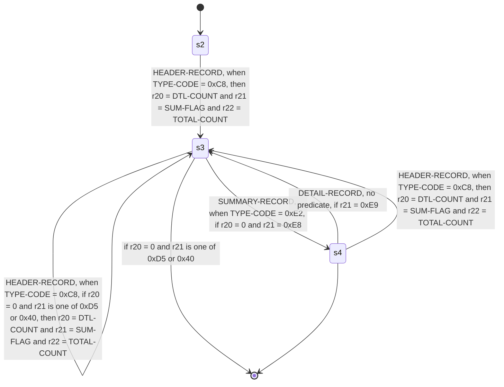

<!-- Code generated by cpybkc-gen-graph. DO NOT EDIT. -->

# The sequencing automaton

**Framing:** delimited — the delimiter is 0x15, standing as a terminator (one follows every record, the last included).

## Registers

A register is what the automaton remembers between records: a binding on a transition writes one, a guard reads one, and nothing else does either. Registers carry identifiers and no names, so each is `r` and its own node identifier — the name the edge labels above give it.

| Register | Holds | Bound by |
| --- | --- | --- |
| r20 | an integer | `s2 --> s3` (HEADER-RECORD), `s3 --> s3` (DETAIL-RECORD), `s3 --> s3` (HEADER-RECORD), `s4 --> s3` (HEADER-RECORD) |
| r21 | bytes | `s2 --> s3` (HEADER-RECORD), `s3 --> s3` (HEADER-RECORD), `s4 --> s3` (HEADER-RECORD) |
| r22 | an integer | `s2 --> s3` (HEADER-RECORD), `s3 --> s3` (HEADER-RECORD), `s4 --> s3` (HEADER-RECORD) |
