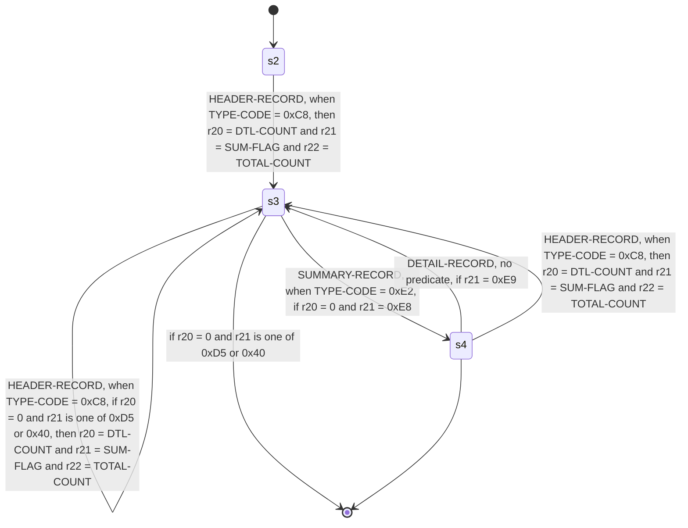

<!-- Code generated by cpybkc-gen-graph. DO NOT EDIT. -->

# The sequencing automaton

**Framing:** delimited — the delimiter is 0x15, standing as a terminator (one follows every record, the last included).

## Registers

A register is what the automaton remembers between records: a binding on a transition writes one, a guard reads one, and nothing else does either. Registers carry identifiers and no names, so each is `r` and its own node identifier — the name the edge labels above give it.

| Register | Holds | Bound by |
| --- | --- | --- |
| r20 | an integer | `s2 --> s3` (HEADER-RECORD), `s3 --> s3` (DETAIL-RECORD), `s3 --> s3` (HEADER-RECORD), `s4 --> s3` (HEADER-RECORD) |
| r21 | bytes | `s2 --> s3` (HEADER-RECORD), `s3 --> s3` (HEADER-RECORD), `s4 --> s3` (HEADER-RECORD) |
| r22 | an integer | `s2 --> s3` (HEADER-RECORD), `s3 --> s3` (HEADER-RECORD), `s4 --> s3` (HEADER-RECORD) |

## Records

Each record's items, in containment order, beginning at the first byte of the record's data.

**The offsets are summed here, not read.** No IR node carries a byte offset: position is stated once, as ordering and width — see docs/ir/SPEC.md, "Ordering and width, and no offset" — so that a producer cannot state it a second time and be wrong in a way no consumer can detect. Every offset below is therefore this generator's own arithmetic over the widths ahead of the item, counting one occurrence — the first — of every group that encloses it and repeats. Where something ahead of an item repeats a number of times that is read at run time, there is no number to print and the offset carries a variable term instead, naming the count.

**The pictures are spelled here, not quoted.** The IR carries no PICTURE character-string anywhere. It carries a category, the number of stored digit positions, the scale, whether the item is signed and where its sign sits, and the picture column is this generator's spelling of those five facts — so `S9(5)V9(2)` may not be the text the copybook wrote for an item it describes exactly. A numeric-edited item's editing characters are not carried at all, and are named rather than invented.

### HEADER-RECORD

| Offset | Width | Item | Usage | Picture | Present |
| --- | --- | --- | --- | --- | --- |
| 0 | 1 | TYPE-CODE | DISPLAY | X(1) | always |
| 1 | 2 | DTL-COUNT | DISPLAY | 9(2) | always |
| 3 | 1 | SUM-FLAG | DISPLAY | X(1) | always |
| 4 | 2 | TOTAL-COUNT | DISPLAY | 9(2) | always |

### DETAIL-RECORD

| Offset | Width | Item | Usage | Picture | Present |
| --- | --- | --- | --- | --- | --- |
| 0 | 1 | TYPE-CODE | DISPLAY | X(1) | always |
| 1 | 3 | AMOUNT | DISPLAY | 9(3) | always |

### SUMMARY-RECORD

| Offset | Width | Item | Usage | Picture | Present |
| --- | --- | --- | --- | --- | --- |
| 0 | 1 | TYPE-CODE | DISPLAY | X(1) | always |
| 1 | 3 | LINE | — | — | always |
| 1 | 3 | LINE.LINE-TEXT | DISPLAY | X(3) | always |
| 4 | 2 | NOTE | — | — | always |
| 4 | 2 | NOTE.NOTE-TEXT | DISPLAY | X(2) | always |
