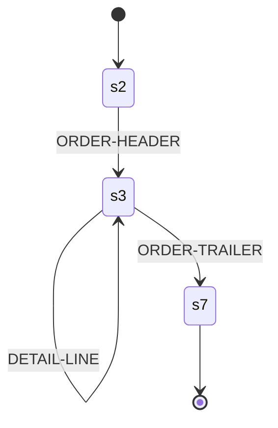

<!-- Code generated by cpybkc-gen-graph. DO NOT EDIT. -->

# The sequencing automaton

**Framing:** delimited — the delimiter is 0x0D 0x0A, standing as a separator (one stands between two records, and nothing follows the last).

