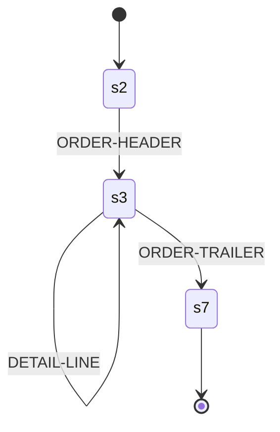

<!-- Code generated by cpybkc-gen-graph. DO NOT EDIT. -->

# The sequencing automaton

**Framing:** descriptor word — every record is preceded by the record descriptor word DFSMS defines.

```mermaid
stateDiagram-v2
    [*] --> s2
    s2 --> s3: ORDER-HEADER
    s3 --> s3: DETAIL-LINE
    s3 --> s7: ORDER-TRAILER
    s7 --> [*]
```
