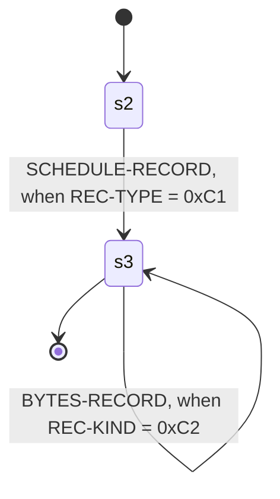

<!-- Code generated by cpybkc-gen-graph. DO NOT EDIT. -->

# The sequencing automaton

**Framing:** unframed — a record's bytes are its extent, and the record behind it begins at the byte after.

## Records

Each record's items, in containment order, beginning at the first byte of the record's data.

**The offsets are summed here, not read.** No IR node carries a byte offset: position is stated once, as ordering and width — see docs/ir/SPEC.md, "Ordering and width, and no offset" — so that a producer cannot state it a second time and be wrong in a way no consumer can detect. Every offset below is therefore this generator's own arithmetic over the widths ahead of the item, counting one occurrence — the first — of every group that encloses it and repeats. Where something ahead of an item repeats a number of times that is read at run time, there is no number to print and the offset carries a variable term instead, naming the count.

**The pictures are spelled here, not quoted.** The IR carries no PICTURE character-string anywhere. It carries a category, the number of stored digit positions, the scale, whether the item is signed and where its sign sits, and the picture column is this generator's spelling of those five facts — so `S9(5)V9(2)` may not be the text the copybook wrote for an item it describes exactly. An edited item's editing characters are not carried at all, so its category is named and nothing of it is spelled. The length of an alphabetic or alphanumeric picture is the item's width in bytes, which is its character count for every charset the IR admits except `none` — the charset axis saying the item's bytes are a payload rather than characters at all, which the picture column names beside the width so that the length is not read as a count of characters.

### SCHEDULE-RECORD

| Offset | Width | Item | Usage | Picture | Present |
| --- | --- | --- | --- | --- | --- |
| 0 | 1 | REC-TYPE | DISPLAY | X(1) | always |
| 1 | 1 | ENTRY-COUNT | DISPLAY | 9(1) | always |
| 2 | 6 × ENTRY-COUNT | ENTRIES | — | — | occurs ENTRY-COUNT times (1 to 3) |
| 2 | 6 | ENTRIES.*variant* | — | — | always |
| 2 | 6 | ENTRIES.OPENING | — | — | in occurrence 1 of the table |
| 2 | 2 | ENTRIES.OPENING.OPENING-CODE | DISPLAY | X(2) | always |
| 4 | 4 | ENTRIES.OPENING.OPENING-BALANCE | DISPLAY | 9(4) | always |
| 2 | 6 | ENTRIES.ADJUSTMENT | DISPLAY | X(6) | in occurrences 2 and 3 of the table |

### BYTES-RECORD

| Offset | Width | Item | Usage | Picture | Present |
| --- | --- | --- | --- | --- | --- |
| 0 | 1 | REC-KIND | DISPLAY | X(1) | always |
| 1 | 15 | ITEMS | — | — | occurs 3 times |
| 1 | 1 | ITEMS.ITEM-KIND | DISPLAY | X(1) | always |
| 2 | 4 | ITEMS.*variant* | — | — | always |
| 2 | 4 | ITEMS.CASH | — | — | when ITEMS.ITEM-KIND = 0xC1 |
| 2 | 4 | ITEMS.CASH.CASH-AMOUNT | DISPLAY | 9(4) | always |
| 2 | 4 | ITEMS.CHEQUE-REF | DISPLAY | X(4) | when ITEMS.ITEM-KIND = 0xC3 |
