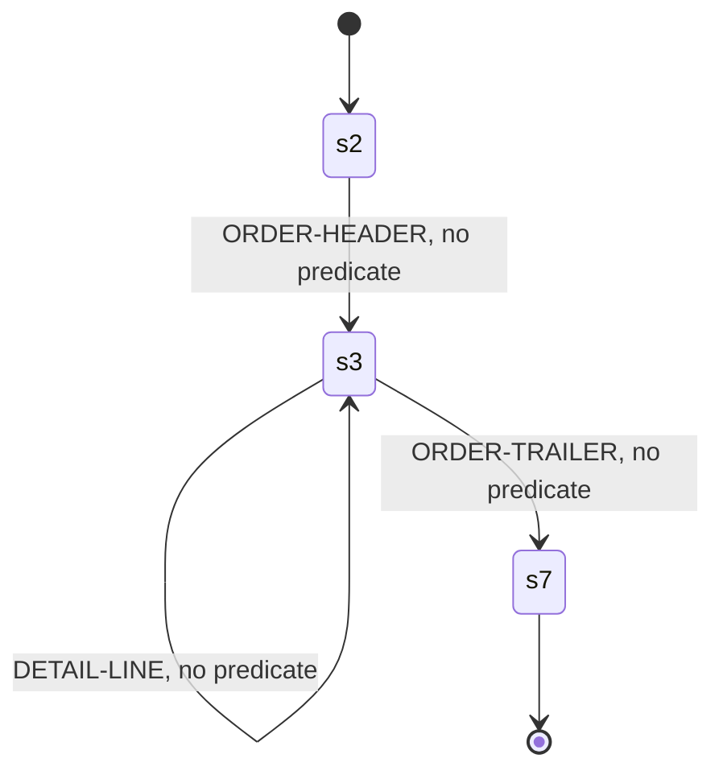

<!-- Code generated by cpybkc-gen-graph. DO NOT EDIT. -->

# The sequencing automaton

**Framing:** segmented — a record is the concatenation of its segments, each preceded by a segment descriptor word, and no segment exceeds 32760 bytes.

