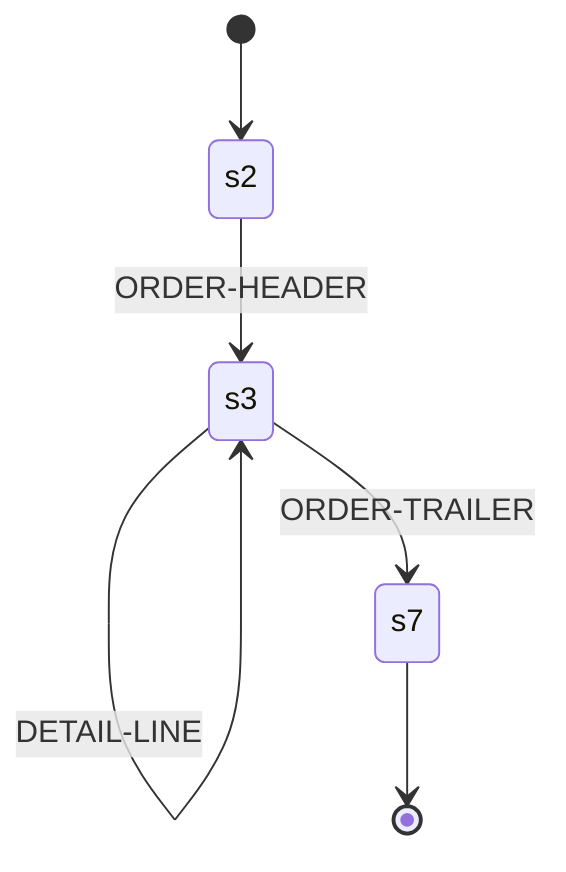

<!-- Code generated by cpybkc-gen-graph. DO NOT EDIT. -->

# The sequencing automaton

**Framing:** unframed — a record's bytes are its extent, and the record behind it begins at the byte after.

```mermaid
stateDiagram-v2
    [*] --> s2
    s2 --> s3: ORDER-HEADER
    s3 --> s3: DETAIL-LINE
    s3 --> s7: ORDER-TRAILER
    s7 --> [*]
```
