<!-- Code generated by cpybkc-gen-graph. DO NOT EDIT. -->

# The sequencing automaton

**Framing:** unframed — a record's bytes are its extent, and the record behind it begins at the byte after.

```mermaid
stateDiagram-v2
    [*] --> s231
    s231 --> s232: PX-FILE-HEADER, when FHD-RECORD-TYPE = 0xF0 0xF0 0xF0
    s232 --> s233: PX-POLICY, when PLC-RECORD-TYPE = 0xD7 0xD3 0xC3
    s232 --> s242: PX-FILE-TRAILER, when FTR-RECORD-TYPE = 0xF9 0xF9 0xF9
    s233 --> s234: PX-INSURED, when INS-RECORD-TYPE = 0xC9 0xD5 0xE2
    s233 --> s235: PX-LOCATION, when LOC-RECORD-TYPE = 0xD3 0xD6 0xC3
    s233 --> s236: PX-VEHICLE, when VEH-RECORD-TYPE = 0xE5 0xC5 0xC8
    s233 --> s237: PX-DRIVER, when DRV-RECORD-TYPE = 0xC4 0xD9 0xE5
    s233 --> s238: PX-COVERAGE, when COV-RECORD-TYPE = 0xC3 0xD6 0xE5
    s233 --> s239: PX-PREMIUM, when PRM-RECORD-TYPE = 0xD7 0xD9 0xD4
    s233 --> s240: PX-CLAIM, when CLM-RECORD-TYPE = 0xC3 0xD3 0xD4
    s233 --> s241: PX-ENDORSEMENT, when ENR-RECORD-TYPE = 0xC5 0xD5 0xD9
    s233 --> s233: PX-POLICY, when PLC-RECORD-TYPE = 0xD7 0xD3 0xC3
    s233 --> s242: PX-FILE-TRAILER, when FTR-RECORD-TYPE = 0xF9 0xF9 0xF9
    s234 --> s234: PX-INSURED, when INS-RECORD-TYPE = 0xC9 0xD5 0xE2
    s234 --> s235: PX-LOCATION, when LOC-RECORD-TYPE = 0xD3 0xD6 0xC3
    s234 --> s236: PX-VEHICLE, when VEH-RECORD-TYPE = 0xE5 0xC5 0xC8
    s234 --> s237: PX-DRIVER, when DRV-RECORD-TYPE = 0xC4 0xD9 0xE5
    s234 --> s238: PX-COVERAGE, when COV-RECORD-TYPE = 0xC3 0xD6 0xE5
    s234 --> s239: PX-PREMIUM, when PRM-RECORD-TYPE = 0xD7 0xD9 0xD4
    s234 --> s240: PX-CLAIM, when CLM-RECORD-TYPE = 0xC3 0xD3 0xD4
    s234 --> s241: PX-ENDORSEMENT, when ENR-RECORD-TYPE = 0xC5 0xD5 0xD9
    s234 --> s233: PX-POLICY, when PLC-RECORD-TYPE = 0xD7 0xD3 0xC3
    s234 --> s242: PX-FILE-TRAILER, when FTR-RECORD-TYPE = 0xF9 0xF9 0xF9
    s235 --> s234: PX-INSURED, when INS-RECORD-TYPE = 0xC9 0xD5 0xE2
    s235 --> s235: PX-LOCATION, when LOC-RECORD-TYPE = 0xD3 0xD6 0xC3
    s235 --> s236: PX-VEHICLE, when VEH-RECORD-TYPE = 0xE5 0xC5 0xC8
    s235 --> s237: PX-DRIVER, when DRV-RECORD-TYPE = 0xC4 0xD9 0xE5
    s235 --> s238: PX-COVERAGE, when COV-RECORD-TYPE = 0xC3 0xD6 0xE5
    s235 --> s239: PX-PREMIUM, when PRM-RECORD-TYPE = 0xD7 0xD9 0xD4
    s235 --> s240: PX-CLAIM, when CLM-RECORD-TYPE = 0xC3 0xD3 0xD4
    s235 --> s241: PX-ENDORSEMENT, when ENR-RECORD-TYPE = 0xC5 0xD5 0xD9
    s235 --> s233: PX-POLICY, when PLC-RECORD-TYPE = 0xD7 0xD3 0xC3
    s235 --> s242: PX-FILE-TRAILER, when FTR-RECORD-TYPE = 0xF9 0xF9 0xF9
    s236 --> s234: PX-INSURED, when INS-RECORD-TYPE = 0xC9 0xD5 0xE2
    s236 --> s235: PX-LOCATION, when LOC-RECORD-TYPE = 0xD3 0xD6 0xC3
    s236 --> s236: PX-VEHICLE, when VEH-RECORD-TYPE = 0xE5 0xC5 0xC8
    s236 --> s237: PX-DRIVER, when DRV-RECORD-TYPE = 0xC4 0xD9 0xE5
    s236 --> s238: PX-COVERAGE, when COV-RECORD-TYPE = 0xC3 0xD6 0xE5
    s236 --> s239: PX-PREMIUM, when PRM-RECORD-TYPE = 0xD7 0xD9 0xD4
    s236 --> s240: PX-CLAIM, when CLM-RECORD-TYPE = 0xC3 0xD3 0xD4
    s236 --> s241: PX-ENDORSEMENT, when ENR-RECORD-TYPE = 0xC5 0xD5 0xD9
    s236 --> s233: PX-POLICY, when PLC-RECORD-TYPE = 0xD7 0xD3 0xC3
    s236 --> s242: PX-FILE-TRAILER, when FTR-RECORD-TYPE = 0xF9 0xF9 0xF9
    s237 --> s234: PX-INSURED, when INS-RECORD-TYPE = 0xC9 0xD5 0xE2
    s237 --> s235: PX-LOCATION, when LOC-RECORD-TYPE = 0xD3 0xD6 0xC3
    s237 --> s236: PX-VEHICLE, when VEH-RECORD-TYPE = 0xE5 0xC5 0xC8
    s237 --> s237: PX-DRIVER, when DRV-RECORD-TYPE = 0xC4 0xD9 0xE5
    s237 --> s238: PX-COVERAGE, when COV-RECORD-TYPE = 0xC3 0xD6 0xE5
    s237 --> s239: PX-PREMIUM, when PRM-RECORD-TYPE = 0xD7 0xD9 0xD4
    s237 --> s240: PX-CLAIM, when CLM-RECORD-TYPE = 0xC3 0xD3 0xD4
    s237 --> s241: PX-ENDORSEMENT, when ENR-RECORD-TYPE = 0xC5 0xD5 0xD9
    s237 --> s233: PX-POLICY, when PLC-RECORD-TYPE = 0xD7 0xD3 0xC3
    s237 --> s242: PX-FILE-TRAILER, when FTR-RECORD-TYPE = 0xF9 0xF9 0xF9
    s238 --> s234: PX-INSURED, when INS-RECORD-TYPE = 0xC9 0xD5 0xE2
    s238 --> s235: PX-LOCATION, when LOC-RECORD-TYPE = 0xD3 0xD6 0xC3
    s238 --> s236: PX-VEHICLE, when VEH-RECORD-TYPE = 0xE5 0xC5 0xC8
    s238 --> s237: PX-DRIVER, when DRV-RECORD-TYPE = 0xC4 0xD9 0xE5
    s238 --> s238: PX-COVERAGE, when COV-RECORD-TYPE = 0xC3 0xD6 0xE5
    s238 --> s239: PX-PREMIUM, when PRM-RECORD-TYPE = 0xD7 0xD9 0xD4
    s238 --> s240: PX-CLAIM, when CLM-RECORD-TYPE = 0xC3 0xD3 0xD4
    s238 --> s241: PX-ENDORSEMENT, when ENR-RECORD-TYPE = 0xC5 0xD5 0xD9
    s238 --> s233: PX-POLICY, when PLC-RECORD-TYPE = 0xD7 0xD3 0xC3
    s238 --> s242: PX-FILE-TRAILER, when FTR-RECORD-TYPE = 0xF9 0xF9 0xF9
    s239 --> s234: PX-INSURED, when INS-RECORD-TYPE = 0xC9 0xD5 0xE2
    s239 --> s235: PX-LOCATION, when LOC-RECORD-TYPE = 0xD3 0xD6 0xC3
    s239 --> s236: PX-VEHICLE, when VEH-RECORD-TYPE = 0xE5 0xC5 0xC8
    s239 --> s237: PX-DRIVER, when DRV-RECORD-TYPE = 0xC4 0xD9 0xE5
    s239 --> s238: PX-COVERAGE, when COV-RECORD-TYPE = 0xC3 0xD6 0xE5
    s239 --> s239: PX-PREMIUM, when PRM-RECORD-TYPE = 0xD7 0xD9 0xD4
    s239 --> s240: PX-CLAIM, when CLM-RECORD-TYPE = 0xC3 0xD3 0xD4
    s239 --> s241: PX-ENDORSEMENT, when ENR-RECORD-TYPE = 0xC5 0xD5 0xD9
    s239 --> s233: PX-POLICY, when PLC-RECORD-TYPE = 0xD7 0xD3 0xC3
    s239 --> s242: PX-FILE-TRAILER, when FTR-RECORD-TYPE = 0xF9 0xF9 0xF9
    s240 --> s234: PX-INSURED, when INS-RECORD-TYPE = 0xC9 0xD5 0xE2
    s240 --> s235: PX-LOCATION, when LOC-RECORD-TYPE = 0xD3 0xD6 0xC3
    s240 --> s236: PX-VEHICLE, when VEH-RECORD-TYPE = 0xE5 0xC5 0xC8
    s240 --> s237: PX-DRIVER, when DRV-RECORD-TYPE = 0xC4 0xD9 0xE5
    s240 --> s238: PX-COVERAGE, when COV-RECORD-TYPE = 0xC3 0xD6 0xE5
    s240 --> s239: PX-PREMIUM, when PRM-RECORD-TYPE = 0xD7 0xD9 0xD4
    s240 --> s240: PX-CLAIM, when CLM-RECORD-TYPE = 0xC3 0xD3 0xD4
    s240 --> s241: PX-ENDORSEMENT, when ENR-RECORD-TYPE = 0xC5 0xD5 0xD9
    s240 --> s233: PX-POLICY, when PLC-RECORD-TYPE = 0xD7 0xD3 0xC3
    s240 --> s242: PX-FILE-TRAILER, when FTR-RECORD-TYPE = 0xF9 0xF9 0xF9
    s241 --> s234: PX-INSURED, when INS-RECORD-TYPE = 0xC9 0xD5 0xE2
    s241 --> s235: PX-LOCATION, when LOC-RECORD-TYPE = 0xD3 0xD6 0xC3
    s241 --> s236: PX-VEHICLE, when VEH-RECORD-TYPE = 0xE5 0xC5 0xC8
    s241 --> s237: PX-DRIVER, when DRV-RECORD-TYPE = 0xC4 0xD9 0xE5
    s241 --> s238: PX-COVERAGE, when COV-RECORD-TYPE = 0xC3 0xD6 0xE5
    s241 --> s239: PX-PREMIUM, when PRM-RECORD-TYPE = 0xD7 0xD9 0xD4
    s241 --> s240: PX-CLAIM, when CLM-RECORD-TYPE = 0xC3 0xD3 0xD4
    s241 --> s241: PX-ENDORSEMENT, when ENR-RECORD-TYPE = 0xC5 0xD5 0xD9
    s241 --> s233: PX-POLICY, when PLC-RECORD-TYPE = 0xD7 0xD3 0xC3
    s241 --> s242: PX-FILE-TRAILER, when FTR-RECORD-TYPE = 0xF9 0xF9 0xF9
    s242 --> [*]
```

## Records

Each record's items, in containment order, beginning at the first byte of the record's data.

**The offsets are summed here, not read.** No IR node carries a byte offset: position is stated once, as ordering and width — see docs/ir/SPEC.md, "Ordering and width, and no offset" — so that a producer cannot state it a second time and be wrong in a way no consumer can detect. Every offset below is therefore this generator's own arithmetic over the widths ahead of the item, counting one occurrence — the first — of every group that encloses it and repeats. Where something ahead of an item repeats a number of times that is read at run time, there is no number to print and the offset carries a variable term instead, naming the count.

**The pictures are spelled here, not quoted.** The IR carries no PICTURE character-string anywhere. It carries a category, the number of stored digit positions, the scale, whether the item is signed and where its sign sits, and the picture column is this generator's spelling of those five facts — so `S9(5)V9(2)` may not be the text the copybook wrote for an item it describes exactly. An edited item's editing characters are not carried at all, so its category is named and nothing of it is spelled. The length of an alphabetic or alphanumeric picture is the item's width in bytes, which is its character count for every charset the IR admits except `none` — the charset axis saying the item's bytes are a payload rather than characters at all, which the picture column names beside the width so that the length is not read as a count of characters.

### PX-FILE-HEADER

| Offset | Width | Item | Usage | Picture | Present |
| --- | --- | --- | --- | --- | --- |
| 0 | 3 | FHD-RECORD-TYPE | DISPLAY | X(3) | always |
| 3 | 20 | FHD-EXTRACT-NAME | DISPLAY | X(20) | always |
| 23 | 8 | FHD-CYCLE-DATE | DISPLAY | 9(8) | always |
| 31 | 6 | FHD-CYCLE-TIME | DISPLAY | 9(6) | always |
| 37 | 4 | FHD-CARRIER | DISPLAY | X(4) | always |
| 41 | 2 | FHD-REGION | DISPLAY | X(2) | always |
| 43 | 8 | FHD-SOURCE-SYSTEM | DISPLAY | X(8) | always |
| 51 | 4 | FHD-RUN-NUMBER | DISPLAY | 9(4) | always |
| 55 | 3 | FHD-FORMAT-VERSION | DISPLAY | 9(3) | always |
| 58 | 198 | *filler* | DISPLAY | X(198) | always |

### PX-POLICY

| Offset | Width | Item | Usage | Picture | Present |
| --- | --- | --- | --- | --- | --- |
| 0 | 3 | PLC-RECORD-TYPE | DISPLAY | X(3) | always |
| 3 | 12 | PLC-POLICY-NUMBER | DISPLAY | X(12) | always |
| 15 | 4 | PLC-CARRIER | DISPLAY | X(4) | always |
| 19 | 8 | PLC-TERM-EFF-DATE | DISPLAY | 9(8) | always |
| 27 | 5 | PLC-SEQ | DISPLAY | 9(5) | always |
| 32 | 6 | PLC-PRODUCT-CODE | DISPLAY | X(6) | always |
| 38 | 4 | PLC-LOB | DISPLAY | X(4) | always |
| 42 | 2 | PLC-STATE | DISPLAY | X(2) | always |
| 44 | 8 | PLC-TERM-EXP-DATE | DISPLAY | 9(8) | always |
| 52 | 8 | PLC-ISSUE-DATE | DISPLAY | 9(8) | always |
| 60 | 2 | PLC-STATUS | DISPLAY | X(2) | always |
| 62 | 8 | PLC-CANCEL-DATE | DISPLAY | 9(8) | always |
| 70 | 3 | PLC-CANCEL-REASON | DISPLAY | X(3) | always |
| 73 | 8 | PLC-AGENCY-CODE | DISPLAY | X(8) | always |
| 81 | 8 | PLC-PRODUCER-CODE | DISPLAY | X(8) | always |
| 89 | 2 | PLC-BILL-METHOD | DISPLAY | X(2) | always |
| 91 | 3 | PLC-PAY-PLAN | DISPLAY | X(3) | always |
| 94 | 2 | PLC-TERM-MONTHS | DISPLAY | 9(2) | always |
| 96 | 6 | PLC-WRITTEN-PREMIUM | PACKED-DECIMAL | S9(9)V9(2) | always |
| 102 | 3 | PLC-RENEWAL-COUNT | DISPLAY | 9(3) | always |
| 105 | 151 | *filler* | DISPLAY | X(151) | always |

### PX-FILE-TRAILER

| Offset | Width | Item | Usage | Picture | Present |
| --- | --- | --- | --- | --- | --- |
| 0 | 3 | FTR-RECORD-TYPE | DISPLAY | X(3) | always |
| 3 | 8 | FTR-CYCLE-DATE | DISPLAY | 9(8) | always |
| 11 | 9 | FTR-POLICY-COUNT | DISPLAY | 9(9) | always |
| 20 | 9 | FTR-DETAIL-COUNT | DISPLAY | 9(9) | always |
| 29 | 8 | FTR-WRITTEN-PREMIUM | PACKED-DECIMAL | S9(13)V9(2) | always |
| 37 | 8 | FTR-PAID-LOSS | PACKED-DECIMAL | S9(13)V9(2) | always |
| 45 | 15 | FTR-HASH-POLICY-NUMBER | DISPLAY | 9(15) | always |
| 60 | 4 | FTR-RUN-NUMBER | DISPLAY | 9(4) | always |
| 64 | 192 | *filler* | DISPLAY | X(192) | always |

### PX-INSURED

| Offset | Width | Item | Usage | Picture | Present |
| --- | --- | --- | --- | --- | --- |
| 0 | 3 | INS-RECORD-TYPE | DISPLAY | X(3) | always |
| 3 | 12 | INS-POLICY-NUMBER | DISPLAY | X(12) | always |
| 15 | 4 | INS-CARRIER | DISPLAY | X(4) | always |
| 19 | 8 | INS-TERM-EFF-DATE | DISPLAY | 9(8) | always |
| 27 | 5 | INS-SEQ | DISPLAY | 9(5) | always |
| 32 | 2 | INS-ROLE | DISPLAY | X(2) | always |
| 34 | 30 | INS-LAST-NAME | DISPLAY | X(30) | always |
| 64 | 20 | INS-FIRST-NAME | DISPLAY | X(20) | always |
| 84 | 1 | INS-MIDDLE-INITIAL | DISPLAY | X(1) | always |
| 85 | 35 | INS-ADDRESS-LINE-1 | DISPLAY | X(35) | always |
| 120 | 35 | INS-ADDRESS-LINE-2 | DISPLAY | X(35) | always |
| 155 | 25 | INS-CITY | DISPLAY | X(25) | always |
| 180 | 2 | INS-STATE | DISPLAY | X(2) | always |
| 182 | 9 | INS-POSTAL-CODE | DISPLAY | X(9) | always |
| 191 | 3 | INS-COUNTRY | DISPLAY | X(3) | always |
| 194 | 8 | INS-BIRTH-DATE | DISPLAY | 9(8) | always |
| 202 | 1 | INS-GENDER | DISPLAY | X(1) | always |
| 203 | 1 | INS-MARITAL-STATUS | DISPLAY | X(1) | always |
| 204 | 4 | INS-TAX-ID-LAST-4 | DISPLAY | X(4) | always |
| 208 | 1 | INS-EMAIL-ON-FILE | DISPLAY | X(1) | always |
| 209 | 47 | *filler* | DISPLAY | X(47) | always |

### PX-LOCATION

| Offset | Width | Item | Usage | Picture | Present |
| --- | --- | --- | --- | --- | --- |
| 0 | 3 | LOC-RECORD-TYPE | DISPLAY | X(3) | always |
| 3 | 12 | LOC-POLICY-NUMBER | DISPLAY | X(12) | always |
| 15 | 4 | LOC-CARRIER | DISPLAY | X(4) | always |
| 19 | 8 | LOC-TERM-EFF-DATE | DISPLAY | 9(8) | always |
| 27 | 5 | LOC-SEQ | DISPLAY | 9(5) | always |
| 32 | 4 | LOC-LOCATION-NUMBER | DISPLAY | 9(4) | always |
| 36 | 35 | LOC-ADDRESS-LINE-1 | DISPLAY | X(35) | always |
| 71 | 25 | LOC-CITY | DISPLAY | X(25) | always |
| 96 | 2 | LOC-STATE | DISPLAY | X(2) | always |
| 98 | 9 | LOC-POSTAL-CODE | DISPLAY | X(9) | always |
| 107 | 5 | LOC-COUNTY-CODE | DISPLAY | X(5) | always |
| 112 | 4 | LOC-TERRITORY | DISPLAY | X(4) | always |
| 116 | 2 | LOC-PROTECTION-CLASS | DISPLAY | X(2) | always |
| 118 | 2 | LOC-CONSTRUCTION-CODE | DISPLAY | X(2) | always |
| 120 | 3 | LOC-OCCUPANCY-CODE | DISPLAY | X(3) | always |
| 123 | 4 | LOC-YEAR-BUILT | DISPLAY | 9(4) | always |
| 127 | 6 | LOC-SQUARE-FEET | DISPLAY | 9(6) | always |
| 133 | 2 | LOC-NUMBER-OF-STORIES | DISPLAY | 9(2) | always |
| 135 | 4 | LOC-DISTANCE-TO-FIRE | DISPLAY | 9(3)V9(1) | always |
| 139 | 4 | LOC-FLOOD-ZONE | DISPLAY | X(4) | always |
| 143 | 113 | *filler* | DISPLAY | X(113) | always |

### PX-VEHICLE

| Offset | Width | Item | Usage | Picture | Present |
| --- | --- | --- | --- | --- | --- |
| 0 | 3 | VEH-RECORD-TYPE | DISPLAY | X(3) | always |
| 3 | 12 | VEH-POLICY-NUMBER | DISPLAY | X(12) | always |
| 15 | 4 | VEH-CARRIER | DISPLAY | X(4) | always |
| 19 | 8 | VEH-TERM-EFF-DATE | DISPLAY | 9(8) | always |
| 27 | 5 | VEH-SEQ | DISPLAY | 9(5) | always |
| 32 | 4 | VEH-UNIT-NUMBER | DISPLAY | 9(4) | always |
| 36 | 17 | VEH-VIN | DISPLAY | X(17) | always |
| 53 | 4 | VEH-MODEL-YEAR | DISPLAY | 9(4) | always |
| 57 | 15 | VEH-MAKE | DISPLAY | X(15) | always |
| 72 | 20 | VEH-MODEL | DISPLAY | X(20) | always |
| 92 | 4 | VEH-BODY-STYLE | DISPLAY | X(4) | always |
| 96 | 2 | VEH-VEHICLE-USE | DISPLAY | X(2) | always |
| 98 | 2 | VEH-GARAGE-STATE | DISPLAY | X(2) | always |
| 100 | 9 | VEH-GARAGE-POSTAL | DISPLAY | X(9) | always |
| 109 | 6 | VEH-ANNUAL-MILEAGE | DISPLAY | 9(6) | always |
| 115 | 3 | VEH-SYMBOL | DISPLAY | X(3) | always |
| 118 | 1 | VEH-ANTI-THEFT | DISPLAY | X(1) | always |
| 119 | 7 | VEH-COST-NEW | DISPLAY | 9(7) | always |
| 126 | 30 | VEH-LIENHOLDER-NAME | DISPLAY | X(30) | always |
| 156 | 1 | VEH-LEASED-FLAG | DISPLAY | X(1) | always |
| 157 | 99 | *filler* | DISPLAY | X(99) | always |

### PX-DRIVER

| Offset | Width | Item | Usage | Picture | Present |
| --- | --- | --- | --- | --- | --- |
| 0 | 3 | DRV-RECORD-TYPE | DISPLAY | X(3) | always |
| 3 | 12 | DRV-POLICY-NUMBER | DISPLAY | X(12) | always |
| 15 | 4 | DRV-CARRIER | DISPLAY | X(4) | always |
| 19 | 8 | DRV-TERM-EFF-DATE | DISPLAY | 9(8) | always |
| 27 | 5 | DRV-SEQ | DISPLAY | 9(5) | always |
| 32 | 3 | DRV-DRIVER-NUMBER | DISPLAY | 9(3) | always |
| 35 | 30 | DRV-LAST-NAME | DISPLAY | X(30) | always |
| 65 | 20 | DRV-FIRST-NAME | DISPLAY | X(20) | always |
| 85 | 8 | DRV-BIRTH-DATE | DISPLAY | 9(8) | always |
| 93 | 1 | DRV-GENDER | DISPLAY | X(1) | always |
| 94 | 1 | DRV-MARITAL-STATUS | DISPLAY | X(1) | always |
| 95 | 2 | DRV-LICENSE-STATE | DISPLAY | X(2) | always |
| 97 | 20 | DRV-LICENSE-NUMBER | DISPLAY | X(20) | always |
| 117 | 8 | DRV-LICENSE-DATE | DISPLAY | 9(8) | always |
| 125 | 2 | DRV-RELATION-TO-INS | DISPLAY | X(2) | always |
| 127 | 4 | DRV-RATED-UNIT | DISPLAY | 9(4) | always |
| 131 | 1 | DRV-GOOD-STUDENT | DISPLAY | X(1) | always |
| 132 | 1 | DRV-TRAINING-FLAG | DISPLAY | X(1) | always |
| 133 | 2 | DRV-POINTS | DISPLAY | 9(2) | always |
| 135 | 1 | DRV-EXCLUDED-FLAG | DISPLAY | X(1) | always |
| 136 | 120 | *filler* | DISPLAY | X(120) | always |

### PX-COVERAGE

| Offset | Width | Item | Usage | Picture | Present |
| --- | --- | --- | --- | --- | --- |
| 0 | 3 | COV-RECORD-TYPE | DISPLAY | X(3) | always |
| 3 | 12 | COV-POLICY-NUMBER | DISPLAY | X(12) | always |
| 15 | 4 | COV-CARRIER | DISPLAY | X(4) | always |
| 19 | 8 | COV-TERM-EFF-DATE | DISPLAY | 9(8) | always |
| 27 | 5 | COV-SEQ | DISPLAY | 9(5) | always |
| 32 | 4 | COV-LOCATION-NUMBER | DISPLAY | 9(4) | always |
| 36 | 4 | COV-UNIT-NUMBER | DISPLAY | 9(4) | always |
| 40 | 6 | COV-COVERAGE-CODE | DISPLAY | X(6) | always |
| 46 | 30 | COV-COVERAGE-DESC | DISPLAY | X(30) | always |
| 76 | 7 | COV-LIMIT-1 | PACKED-DECIMAL | S9(11)V9(2) | always |
| 83 | 7 | COV-LIMIT-2 | PACKED-DECIMAL | S9(11)V9(2) | always |
| 90 | 5 | COV-DEDUCTIBLE | PACKED-DECIMAL | S9(7)V9(2) | always |
| 95 | 2 | COV-DEDUCTIBLE-TYPE | DISPLAY | X(2) | always |
| 97 | 8 | COV-EFF-DATE | DISPLAY | 9(8) | always |
| 105 | 8 | COV-EXP-DATE | DISPLAY | 9(8) | always |
| 113 | 8 | COV-FORM-CODE | DISPLAY | X(8) | always |
| 121 | 6 | COV-CLASS-CODE | DISPLAY | X(6) | always |
| 127 | 6 | COV-RATE | PACKED-DECIMAL | S9(5)V9(5) | always |
| 133 | 2 | COV-EXPOSURE-BASIS | DISPLAY | X(2) | always |
| 135 | 1 | COV-WAIVER-FLAG | DISPLAY | X(1) | always |
| 136 | 120 | *filler* | DISPLAY | X(120) | always |

### PX-PREMIUM

| Offset | Width | Item | Usage | Picture | Present |
| --- | --- | --- | --- | --- | --- |
| 0 | 3 | PRM-RECORD-TYPE | DISPLAY | X(3) | always |
| 3 | 12 | PRM-POLICY-NUMBER | DISPLAY | X(12) | always |
| 15 | 4 | PRM-CARRIER | DISPLAY | X(4) | always |
| 19 | 8 | PRM-TERM-EFF-DATE | DISPLAY | 9(8) | always |
| 27 | 5 | PRM-SEQ | DISPLAY | 9(5) | always |
| 32 | 6 | PRM-COVERAGE-CODE | DISPLAY | X(6) | always |
| 38 | 4 | PRM-TRANSACTION-CODE | DISPLAY | X(4) | always |
| 42 | 8 | PRM-TRANSACTION-DATE | DISPLAY | 9(8) | always |
| 50 | 6 | PRM-ACCOUNTING-PERIOD | DISPLAY | 9(6) | always |
| 56 | 6 | PRM-WRITTEN-AMOUNT | PACKED-DECIMAL | S9(9)V9(2) | always |
| 62 | 6 | PRM-EARNED-AMOUNT | PACKED-DECIMAL | S9(9)V9(2) | always |
| 68 | 6 | PRM-UNEARNED-AMOUNT | PACKED-DECIMAL | S9(9)V9(2) | always |
| 74 | 5 | PRM-COMMISSION-AMOUNT | PACKED-DECIMAL | S9(7)V9(2) | always |
| 79 | 4 | PRM-COMMISSION-RATE | PACKED-DECIMAL | S9(3)V9(4) | always |
| 83 | 5 | PRM-TAX-AMOUNT | PACKED-DECIMAL | S9(7)V9(2) | always |
| 88 | 5 | PRM-FEE-AMOUNT | PACKED-DECIMAL | S9(7)V9(2) | always |
| 93 | 5 | PRM-SURCHARGE-AMOUNT | PACKED-DECIMAL | S9(7)V9(2) | always |
| 98 | 3 | PRM-CURRENCY | DISPLAY | X(3) | always |
| 101 | 10 | PRM-GL-ACCOUNT | DISPLAY | X(10) | always |
| 111 | 4 | PRM-STATUTORY-LINE | DISPLAY | X(4) | always |
| 115 | 141 | *filler* | DISPLAY | X(141) | always |

### PX-CLAIM

| Offset | Width | Item | Usage | Picture | Present |
| --- | --- | --- | --- | --- | --- |
| 0 | 3 | CLM-RECORD-TYPE | DISPLAY | X(3) | always |
| 3 | 12 | CLM-POLICY-NUMBER | DISPLAY | X(12) | always |
| 15 | 4 | CLM-CARRIER | DISPLAY | X(4) | always |
| 19 | 8 | CLM-TERM-EFF-DATE | DISPLAY | 9(8) | always |
| 27 | 5 | CLM-SEQ | DISPLAY | 9(5) | always |
| 32 | 14 | CLM-CLAIM-NUMBER | DISPLAY | X(14) | always |
| 46 | 8 | CLM-LOSS-DATE | DISPLAY | 9(8) | always |
| 54 | 8 | CLM-REPORTED-DATE | DISPLAY | 9(8) | always |
| 62 | 8 | CLM-CLOSED-DATE | DISPLAY | 9(8) | always |
| 70 | 2 | CLM-STATUS | DISPLAY | X(2) | always |
| 72 | 4 | CLM-CAUSE-OF-LOSS | DISPLAY | X(4) | always |
| 76 | 6 | CLM-COVERAGE-CODE | DISPLAY | X(6) | always |
| 82 | 4 | CLM-LOCATION-NUMBER | DISPLAY | 9(4) | always |
| 86 | 4 | CLM-UNIT-NUMBER | DISPLAY | 9(4) | always |
| 90 | 8 | CLM-ADJUSTER-CODE | DISPLAY | X(8) | always |
| 98 | 7 | CLM-PAID-INDEMNITY | PACKED-DECIMAL | S9(11)V9(2) | always |
| 105 | 6 | CLM-PAID-EXPENSE | PACKED-DECIMAL | S9(9)V9(2) | always |
| 111 | 7 | CLM-RESERVE-INDEMNITY | PACKED-DECIMAL | S9(11)V9(2) | always |
| 118 | 6 | CLM-RESERVE-EXPENSE | PACKED-DECIMAL | S9(9)V9(2) | always |
| 124 | 1 | CLM-SUBROGATION-FLAG | DISPLAY | X(1) | always |
| 125 | 131 | *filler* | DISPLAY | X(131) | always |

### PX-ENDORSEMENT

| Offset | Width | Item | Usage | Picture | Present |
| --- | --- | --- | --- | --- | --- |
| 0 | 3 | ENR-RECORD-TYPE | DISPLAY | X(3) | always |
| 3 | 12 | ENR-POLICY-NUMBER | DISPLAY | X(12) | always |
| 15 | 4 | ENR-CARRIER | DISPLAY | X(4) | always |
| 19 | 8 | ENR-TERM-EFF-DATE | DISPLAY | 9(8) | always |
| 27 | 5 | ENR-SEQ | DISPLAY | 9(5) | always |
| 32 | 4 | ENR-ENDORSEMENT-NUMBER | DISPLAY | 9(4) | always |
| 36 | 12 | ENR-FORM-NUMBER | DISPLAY | X(12) | always |
| 48 | 6 | ENR-FORM-EDITION | DISPLAY | X(6) | always |
| 54 | 40 | ENR-FORM-TITLE | DISPLAY | X(40) | always |
| 94 | 8 | ENR-EFF-DATE | DISPLAY | 9(8) | always |
| 102 | 8 | ENR-EXP-DATE | DISPLAY | 9(8) | always |
| 110 | 4 | ENR-TRANSACTION-CODE | DISPLAY | X(4) | always |
| 114 | 8 | ENR-TRANSACTION-DATE | DISPLAY | 9(8) | always |
| 122 | 6 | ENR-PREMIUM-DELTA | PACKED-DECIMAL | S9(9)V9(2) | always |
| 128 | 4 | ENR-LOCATION-NUMBER | DISPLAY | 9(4) | always |
| 132 | 4 | ENR-UNIT-NUMBER | DISPLAY | 9(4) | always |
| 136 | 6 | ENR-COVERAGE-CODE | DISPLAY | X(6) | always |
| 142 | 1 | ENR-MANDATORY-FLAG | DISPLAY | X(1) | always |
| 143 | 1 | ENR-PRINT-FLAG | DISPLAY | X(1) | always |
| 144 | 2 | ENR-STATE-FILED | DISPLAY | X(2) | always |
| 146 | 110 | *filler* | DISPLAY | X(110) | always |
